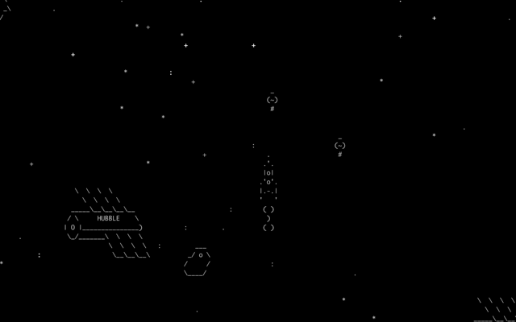

# Spaceship - terminal game

This is small terminal game based on asynchronous python library [asyncio](https://docs.python.org/3/library/asyncio.html).

## Get started

- Programming language is Python 3.8.5.

All dependencies are standart python libraries. For start the game in terminal type following command:

```bash
python3 spacegame.py
```

## Gameplay

The spaceship is controlled by arrows on keyboard:

`⬅` - left

`➡` - right

`⬆` - up

`⬇` - down

`space` - fire (allow after 2020 year)

Player have to avoid collision with flying garbages. After 2020 year spaceship will be equipped by the gun and player can destroy the garbages. If spaceship collide with a garbage gameover.

## Game video



## License

You can copy, distribute and modify the software.

## Motivation

This project was created as part of online course for web developer [dvmn.org](https://dvmn.org/modules/).
